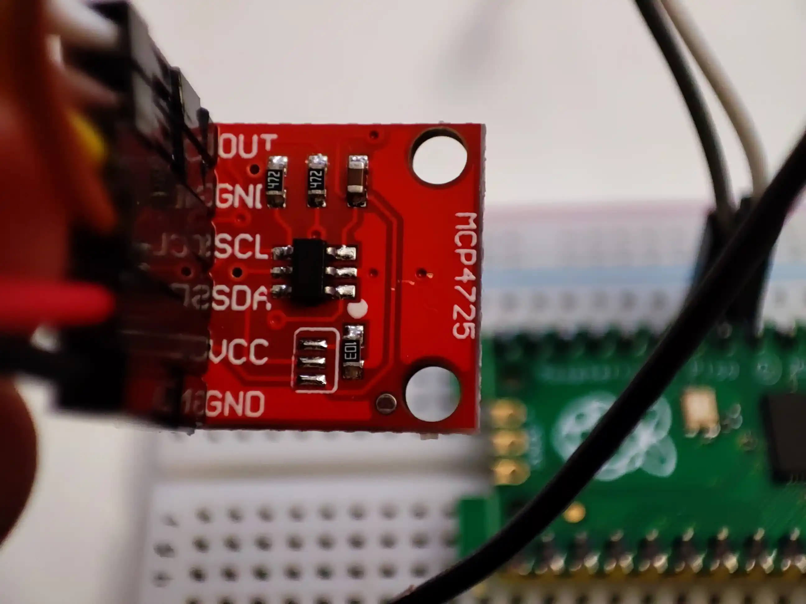

# mcp4725.py – Simple MicroPython Driver for the MCP4725 DAC

mcp4725-py is a lightweight, dependency-free driver for the MCP4725 12-bit DAC, providing a few additional intuitive features for any MicroPython board with I2C support.



It was developed for a hobby project using a Raspberry Pi Pico board, to turn this :

 ``` python
value = max(0, min(4095, int(2792)))
buf = bytearray(3)
buf[0] = 0x40 
buf[1] = value >> 4
buf[2] = (value & 0xF) << 4
self.i2c.writeto(self.address, buf)
```

into this:

``` python
dac.set_voltage(2.25)
```

---

## Features

* Single-file, drop-in driver — no external dependencies, no installation tools required
* Clean, Pythonic API for voltage, normalized, or raw output
* Compatible with standard and clone MCP4725 modules (with 8-bit fallback modes)

---

## Quick Start

Assuming you have `mcp4725.py` on your borad's flash memory or your project folder:

```python
from machine import I2C, Pin
from mcp4725 import MCP4725

i2c = I2C(0, sda=Pin(0), scl=Pin(1), freq=400000)
dac = MCP4725(i2c, vcc=3.3)

dac.set_value(2048)          # Set raw 12-bit value
dac.set_voltage(1.65)        # Or set the voltage directly
dac.set_value_norm(0.5)      # Or set a ratio from 0.0 - 1.0
```

See [mcp4725_quickstart.py](mcp4725_quickstart.py) for a more in-depth example.

---

## Installation

Copy `mcp4725.py` into your MicroPython project folder (alongside your main script):

```
/mcp4725.py
```

Then import and use as shown above. No build steps or package managers are needed.

---

## Usage Notes / Considerations

* Driver works on any MicroPython or CircuitPython board with I2C support.
* `set_voltage()` cannot actually determine voltage and requires the correct `vcc` reference voltage to work as expected (the voltage supplied to your MCP4725, e.g., 3.3 or 5.0).
* All input values are clamped to valid ranges (overflows will not error).
* Compatibility functions provided for clone/nonstandard modules that fail with the standard one.

---

## Known Limitations

* No explicit error handling for I2C bus errors (exceptions will propagate).
* Does not detect device presence or bus lock-up.

---

## License

This project is licensed under the MIT License – see the [LICENSE](LICENSE) file for details.

---

## Author

Jean-Marie Prévost
[https://github.com/JeanMariePrevost](https://github.com/JeanMariePrevost)